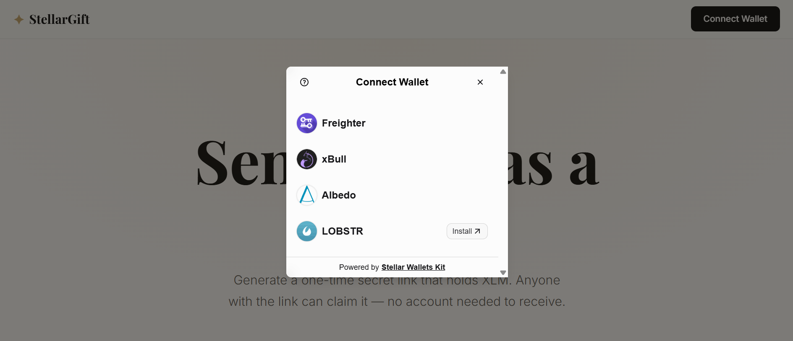

# 🟡 Level 2 - Yellow Belt Submission

## 👉 Overview
In Level 2 - Yellow Belt, the application is upgraded from direct peer-to-peer account creation to a fully decentralized escrow model utilizing a compiled **Soroban smart contract**. In addition, the wallet connection interface is enhanced using the **StellarWalletsKit** to support multiple wallet providers seamlessly.

---

## 📝 Deliverables

### 1. Smart Contract Details
The Soroban smart contract acts as a secure escrow holding gifted funds until claimed by the recipient.
*   **Contract ID:** `CCLS7LDBNGFGXRSBMXS6CTJF6LPIKKK3FUA6WE2UILL5WTVNH2DK5NST`
*   **Deployment Tx Hash:** [997c81d54ae8d562344d48100468e4618aa85775fee6f576099809d97e923b64](https://stellar.expert/explorer/testnet/tx/997c81d54ae8d562344d48100468e4618aa85775fee6f576099809d97e923b64)
*   **Stellar Explorer Link:** [CCLS7LDBNGFGXRSBMXS6CTJF6LPIKKK3FUA6WE2UILL5WTVNH2DK5NST](https://stellar.expert/explorer/testnet/contract/CCLS7LDBNGFGXRSBMXS6CTJF6LPIKKK3FUA6WE2UILL5WTVNH2DK5NST)

### 2. Multi-Wallet Options Modal
We integrated `@creit.tech/stellar-wallets-kit` to support:
*   Freighter Wallet
*   xBull Wallet
*   Albedo Wallet
*   Lobstr Wallet

#### Screenshot: Wallet Options Available

---

## 🛠 Features Implemented
1.  **Escrow Smart Contract in Rust:**
    *   `create_gift(id: Symbol, sender: Address, token: Address, amount: i128, message: String)`: Pulls funds from the sender's account into the contract's escrow using the Stellar Asset Contract (SAC) bridge.
    *   `claim_gift(id: Symbol, recipient: Address)`: Transfers the escrowed funds from the contract to the recipient.
    *   `get_gift(id: Symbol)`: Reads and deserializes the persistent contract state into a `GiftCard` struct.
2.  **Robust Error Handling:**
    *   Defined structured enum error types (`AlreadyExists`, `DoesNotExist`, `AlreadyClaimed`, `InvalidAmount`) which propagate safely on-chain.
3.  **On-chain State Synchronization:**
    *   Real-time polling for RPC transaction finalization.
    *   Decoding contract storage entry states using SDK's native conversion helpers.
